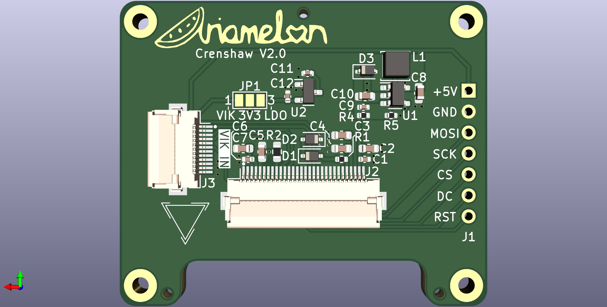

# Crenshaw
[VIK](https://github.com/sadekbaroudi/vik)-compatible breakout board for a 1.5" SSD1351 RGB OLED.

## Disclaimer
This board is licensed under CC BY 4.0.

## VIK module certification card

| Category                | Classification          | Response           |
| ----------------------- | ----------------------- | ------------------ |
| FPC connector           | Required                | :heavy_check_mark: |
| Breakout pins           | Recommended             | :x:                |
| Uses: SPI               | Optional                | :heavy_check_mark: |
| SPI used for SPI only   | Strongly recommended    | :heavy_check_mark: |
| Uses: I2C               | Optional                | :x:                |
| I2C used for I2C only   | Strongly Recommended    | N/A                |
| I2C pull ups            | Required                | N/A                |
| Uses: RGB               | Optional                | :x:                |
| Uses: Extra GPIO 1      | Optional                | :heavy_check_mark: |
| Uses: Extra GPIO 2      | Optional                | :heavy_check_mark: |

## Changelog
* 27/07/2023: Added voltage regulator, SSD1351 supporting circuitry and [VIK](https://github.com/sadekbaroudi/vik) connector. Added license. Added metadata to schematic and board files. Added VIK module certification card.
* 26/07/2023: Updated to V2.0.
* 11/11/2020: Updated to V1.2. Slightly increased size. Moved ribbon cable connector away from center of board as it was causing issues where it was. Spread components apart to allow for easier soldering.
* 30/09/2020: Updated to V1.1. Fixed orientation of I2C headers, increased silkscreen text size, moved ribbon cable connector further towards center of board.
* 29/09/2020: D1 SOD323 switched to SOD123.
* 27/09/2020: Initial commit.